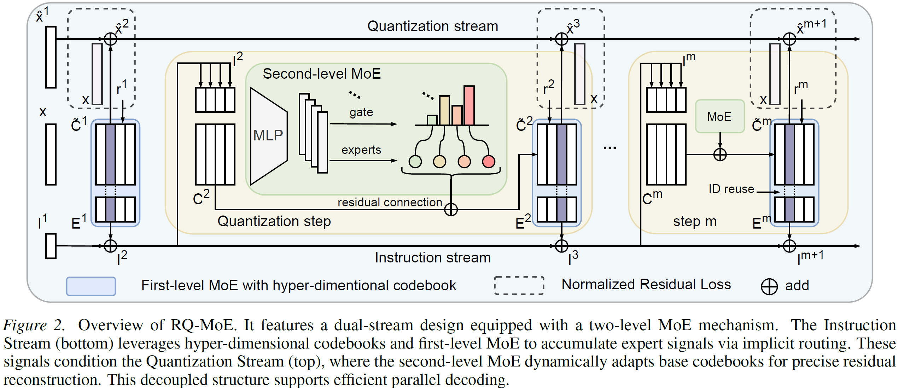

# RQ-MoE


<h2 align="center">
RQ-MoE: Residual Quantization via Mixture of Experts for Efficient Input-Dependent Vector Compression
</h2>

<p align="center">
  🚀 Official implementation of the ICML 2026 paper
</p>

<p align="center">
  <a href="https://arxiv.org/abs/2605.14359">📄 Paper</a> |
  <a href="https://github.com/KDEGroup/RQ-MoE">💻 Code</a>
</p>

<p align="center">
  
  
  
  
</p>

---

## 📢 News

- **[2026/05/01]** 🎉 RQ-MoE has been accepted to **ICML 2026**.
- **[2026/05/15]** 📄 arXiv version released.

---

# ✨ Overview

RQ-MoE is a dynamic residual quantization framework designed for large-scale high-dimensional vector compression.

Traditional residual quantization methods rely on static codebooks shared across all inputs, which limits their ability to accurately model heterogeneous embedding distributions. Recent dynamic quantization approaches improve expressiveness through input-dependent codebooks, but often introduce strong sequential dependencies that significantly slow down decoding.

RQ-MoE addresses this challenge through a hierarchical Mixture-of-Experts (MoE) architecture combined with a dual-stream residual quantization mechanism. The framework enables expressive input-adaptive quantization while supporting partially parallel decoding during inference.

<p align="center">  </p>
---

# 🔥 Motivation

Residual Quantization (RQ) is a fundamental technique for compressing dense embeddings in retrieval, recommendation, and large-scale vector search systems.

Existing methods typically face a trade-off between expressiveness and efficiency:

| Method | Advantage | Limitation |
|---|---|---|
| Classic Quantizers | ⚡ Fast decoding | ❌ Limited expressiveness |
| Dynamic Quantizers | 🎯 Adaptive codebooks | 🐢 Strict sequential decoding |
| **RQ-MoE** | 🚀 Adaptive + Parallelizable | --- |

RQ-MoE resolves this issue through:

- **Instruction-conditioned codeword refinement**
- **Dual-stream residual quantization**
- **Partially parallel decoding**

<p align="center">
  
</p>

---

# 🏗️ Repository Structure

```text
release/
├── train_rqmoe.py        # Training entry
├── model_rqmoe.py        # RQ-MoE model
├── datasets.py           # Dataset wrapper
├── utils.py              # Utilities: checkpoint, scheduler, logging...
├── run_rqmoe.sh          # Recommended training launcher
├── process_bvecs.py      # Extract vectors from .bvecs 
├── environment.yaml      # Conda environment
└── data/                 # Dataset directory
```

---

# ⚙️ Installation

## Requirements

- Python 3.8+
- PyTorch 2.x
- FAISS (with `faiss.contrib`)
- NumPy

## Conda (Recommended)

```bash
conda env create -f environment.yaml
conda activate rqmoe
```

## pip

```bash
pip install torch numpy
pip install faiss-gpu   # or faiss-cpu
```

---

# 📚 Dataset Preparation

## Supported Datasets

- BIGANN
- Deep
- FB-SSNPP
- Contriever

FAISS-style datasets should follow the official FAISS dataset structure.

## Custom `.npy` Dataset

```bash
python train_rqmoe.py \
  --training_data /path/to/vectors.npy \
  --nt 500000 \
  --nval 10000
```

The `.npy` file should contain vectors of shape `(N, d)`.

---

# 🚀 Quick Start

```bash
cd RQ-MoE
conda activate rqmoe

# Single GPU
bash run_rqmoe.sh

# Specify GPU
bash run_rqmoe.sh 5

# Multi-GPU DDP
bash run_rqmoe.sh --gpus 0,1,2,3
```

Modify experiment settings in `run_rqmoe.sh`:

- `M`
- `N`
- `L`
- `DATASET`
- `BATCH_SIZE`


## Training with Single GPU

```bash
python train_rqmoe.py \
  --dataset bigann1M \
  --nt 500000 \
  --nval 10000 \
  --M 4 --K 256 --N 4 --L 2 --H 256 \
  --dropout 0.1 \
  --batch_size 4096 \
  --max_epochs 1000 \
  --lr 1e-3 \
  --model checkpoint/model.pt \
  --checkpoint checkpoint/checkpoint.pt \
  --device cuda:0
```

## Training with GPUs

```bash
python train_rqmoe.py \
  --dataset bigann1M \
  --gpus 0,1,2,3 \
  --nt 500000 \
  --nval 10000 \
  --M 4 --K 256 --N 4 --L 2 --H 256 \
  --batch_size 4096 \
  --model checkpoint/model.pt \
  --checkpoint checkpoint/checkpoint.pt
```

---

# 📦 Output Files

| Path | Description |
|---|---|
| `checkpoint/model.pt` | Best validation model |
| `checkpoint/checkpoint.pt` | Resume checkpoint |
| `checkpoint/model.log` | Training logs |

---

# 📖 Citation

```bibtex
@article{zhong2026rqmoe,
  title={RQ-MoE: Residual Quantization via Mixture of Experts for Efficient Input-Dependent Vector Compression},
  author={Zhong, Zhengjia and others},
  journal={arXiv preprint arXiv:2605.14359},
  year={2026}
}
```

---

# 📄 License

This repository is released for research and academic purposes only.